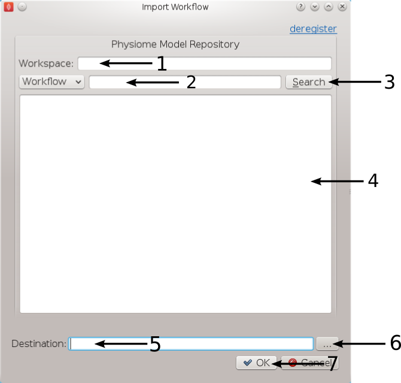
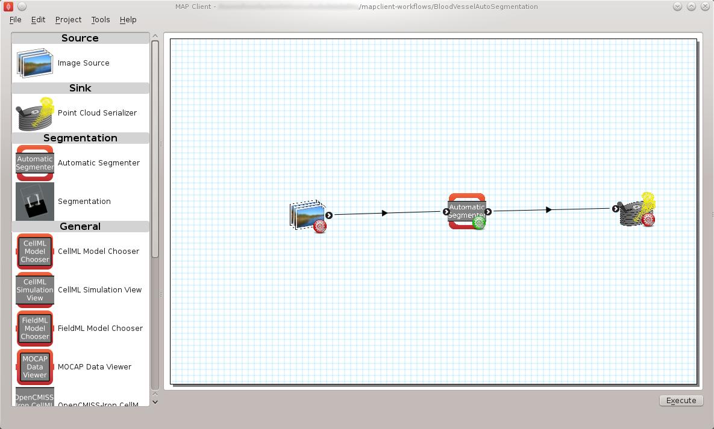
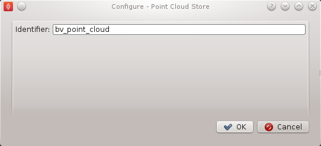
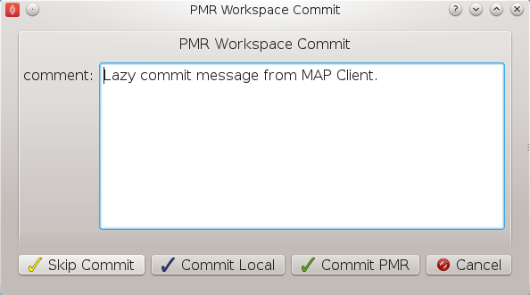
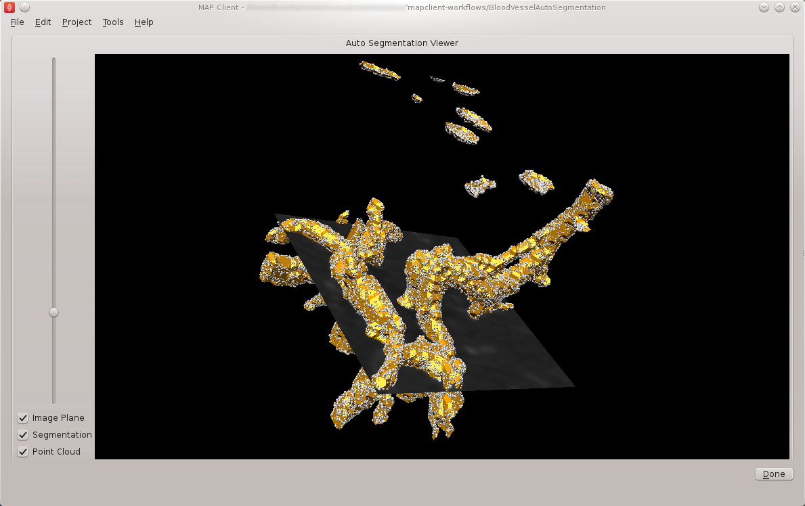

.. _mapclient-autoseg:

=========================================================
Automatic segmentation of a three-dimensional image stack
=========================================================

The purpose of this first task is to demonstrate some of the capabilities of the MAP Client workflow tool.

Import Workflow from PMR
========================

Start the 'mapclient' application.  Use the 'File' menu to select the import action.  The dialog that appears connects to webservices on PMR that will enable us to search for MAP Client workflows.

   **Figure 1**: Import Dialog [**1**] Workspace url, [**2**] Search text, [**3**] Search button, [**4**] Search results, [**5**] Destination directory, [**6**] Directory chooser button, [**7**] Confirm or cancel import.

We will leave the 'Search text' [**2**] blank and click the search button to search for all Workflows available on PMR.  Once the search results are displayed in [**4**] select the entry with the title 'Workflow: BloodVesselAutoSegmentation'.  This will put the Workspace url in the 'Workspace url' [**1**] box.  Next use the 'Directory chooser button' [**7**] to choose a local directory for importing the 'Workflow' to.  The chosen directory will be put in the 'Destination directory' [**5**].  When the 'Workflow url' and 'Directory destination' are correct press the 'Ok' button to complete the import.

Blood Vessel Automatic Segmentation Workflow
============================================

The Blood Vessel Automatic Segmentation Workflow consists of three workflow steps as shown in `Figure 2`_.  

.. _`Figure 2`:

   
   **Figure 2**: Blood Vessel Automatic Segmentation Workflow.
   
#. An image source step.

   This step is designed to pass the location of an image or images through to another step.  This step also has the functionality to download content from PMR.
   
#. An automatic segmentation step.

   This step takes in the location of the image set and reads in the images using OpenCMISS-Zinc.  The images are analyzed, segmented and then discretized into a point cloud.  The output from this step is a list of point locations in the image space.

#. A point cloud serialization step.

   This step serializes a list of point locations to disk.

Before the workflow can be executed each step in the workflow must be configured and the workflow saved.  A gear icon in the bottom right hand corner of the step icon on the workflow canvas indicates whether the step is configured or not.  A red icon represents an unconfigured step whilst a green icon represents a configured step.  Clicking on the gear icon will display a configuration dialog for the step (if the step requires manual configuration).  When a step has been configured correctly the green icon will be displayed.  For our workflow we need to configure the image source step and the point cloud serialization step.  A detailed discussion on configuring all the steps in this workflow is given below.

Workflow Configuration
----------------------

This section describes how each step should be configured.  

Image Source Step
^^^^^^^^^^^^^^^^^

The image source step requires a unique identifier for the step to be set.  It also requires either a location on the local disk where the image data is located or a PMR workspace url from which the image data may be downloaded.

This step configuration makes use of the PMR search widget which gives us the ability to search available workspaces on PMR.  We will make use of this functionality in this example.  In the image source step configuration dialog seen in `Figure 3`_ we can see that there is a place to set a unique identifier for the step and also two tabs, one tab is for setting the image dataset location on the local disk and the other tab is for searching PMR workspaces for image data.  We will leave the local disk edit box on the local file system tab empty and allow the configuration to set the default location.

.. _`Figure 3`:

.. figure:: images/autosegmentation_image_configureblank.png
   :align: center
   :width: 30%
   
   **Figure 3**: Image source step configuration dialog.

Set the identifer edit box to bv_images and select the Physiome Model Repository tab so that we can search PMR for our images.  On this tab we see 
We are going to conduct an ontological term search for our images, we are looking for some images that show an anyeurism in the anterior communicating artery.  To do this we can start entering the text anterior communicating artery into the search term edit box [**3**], when we pause in our typing the dialog will query the PMR OWL terms for suitable matches.  We will see results similar to what is shown in `Figure 5`_, we can click on the matching term in this list and the correct reference will be added to the search term edit box [**3**] for us.

.. figure:: images/autosegmentation_image_configurepmr.png
   :align: center
   :width: 40%
   
   **Figure 4**: PMR search tab, [**1**] Workspace url, [**2**] Search type combobox, [**3**] Search term, [**4**] Search button, [**5**] Search results.

.. _`Figure 5`:

.. figure:: images/autosegmentation_image_owltermscompleter.png
   :align: center
   :width: 30%
   
   **Figure 5**: PMR OWL terms.

With the correct term in place we can click the search button to return matching results from PMR.  We will get back a single result Blood Vessel in MR Images.  When we select this result in the search results list [**5**] the url for the workspace will be loaded into the workspace url edit box [**1**].  We should now have the dialog looking similar to `Figure 6`_.

.. _`Figure 6`:

.. figure:: images/autosegmentation_image_antcommartresults.png
   :align: center
   :width: 30%
   
   **Figure 6**: Completed Physiome Model Repository search tab.

This completes the configuration of the image source step.  When we click Ok in the dialog the images will be downloaded to the default directory on our local disk.

We can also use the combobox at the bottom of the dialog (`Figure 3`_) to set the image type however this is only necessary if the image type cannot be determined through the filename extension.  In our case we can leave this as it is.

Alternatively, if PMR is unavailable copy the images from a usb memory stick into a directory on your computer, set the location on the local file system tab to this directory.

Automatic Segmentation Step
^^^^^^^^^^^^^^^^^^^^^^^^^^^

The automatic segmentation step does not require any configuration.  Whilst this makes the configuration stage unnecessary it limits the usefulness or this step since it is configured to work for a only one set of images.  An obvious enhancment to this step would be to expose the configurable properties of the segmentation to the user.

Point Cloud Serialization Step
^^^^^^^^^^^^^^^^^^^^^^^^^^^^^^

The point cloud serialization step only requires the identifier for the step to be specified.  The identifier will also be used to create an output directory of the same name and the serialization of the input data will be placed into a file under this directory.  Set the identifier to 'bv_point_cloud' (as in `Figure 7`_).

.. _`Figure 7`:

   
   **Figure 7**: Point cloud configuration dialog.
   
Execute the Workflow
====================

Once all the workflow steps have been correctly configured save the workspace.  We can do this through the File menu and selecting the save entry or by using the keyboard shortcut 'ctrl+s'.  Because we have a workflow based on a version control system the commit dialog will appear so that we can keep a record of the changes.  `Figure 8`_ shows this dialog, here we want to choose the skip commit option to save our workflow.  In this example we are not going to commit our changes back to the workspace on PMR.

.. _`Figure 8`:

   
   **Figure 8**: PMR workspace commit dialog.
   
At this point we are ready to begin executing the workflow.  To do this we click the execute button in the lower right hand corner of the window.

Execution
=========

Once the execute button has been clicked the workflow will start to traverse the underlying directed graph, in our case starting from the image source step.  In this simple workflow the only interactive step is the automatic segmentation step which displays a visualisation of the segmentation.

The automatic segmentation step shows a 3D interactive scene, where we can use the mouse to change the view of the scene.  A brief description of some of the possible mouse actions is given here, the left-mouse button will rotate the scene, the right-mouse button will zoom the scene and the middle-mouse button will translate the scene.  We also have some controls to show and hide the graphical elements in the scene and a slider that will change the z-component of the image plane.  `Figure 9`_ shows the segmentation step interactive scene.

.. _`Figure 9`:

   
   **Figure 9**: Autosegmentation step screen.
   
To continue with the execution of the workflow click the done button in the lower right hand corner.  When the workflow has finished executing all the steps in the workflow the workflow editor screen will be shown.

Check Output
============

We can now examine the output of the workflow using any text editor.  The output is stored in a file called point_cloud.txt in a directory bv_point_cloud which can be found under the workflow directory.

