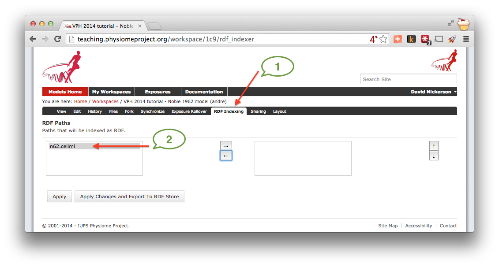
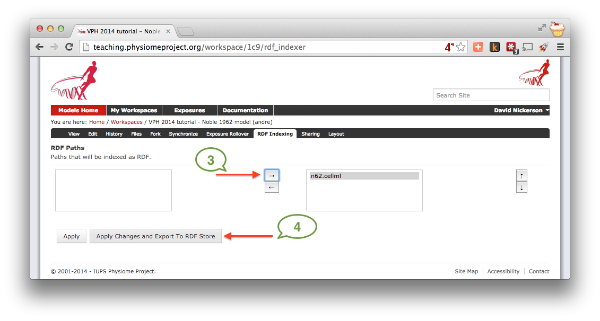
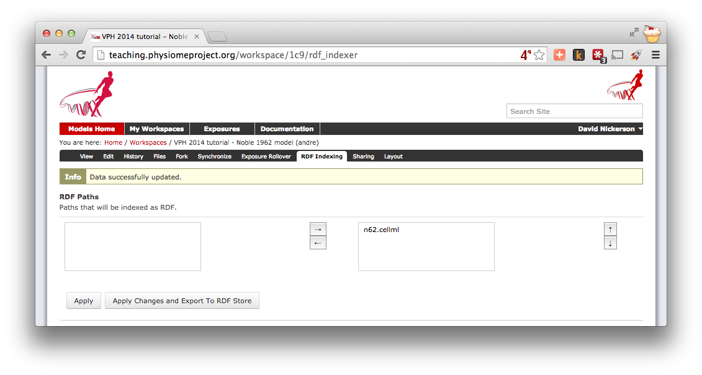
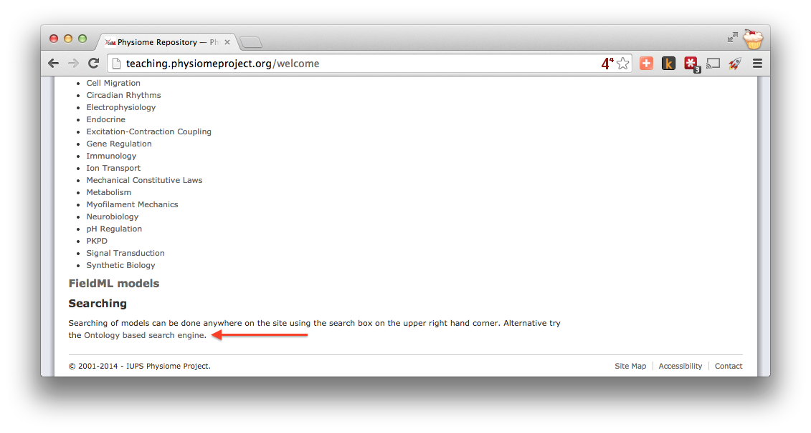
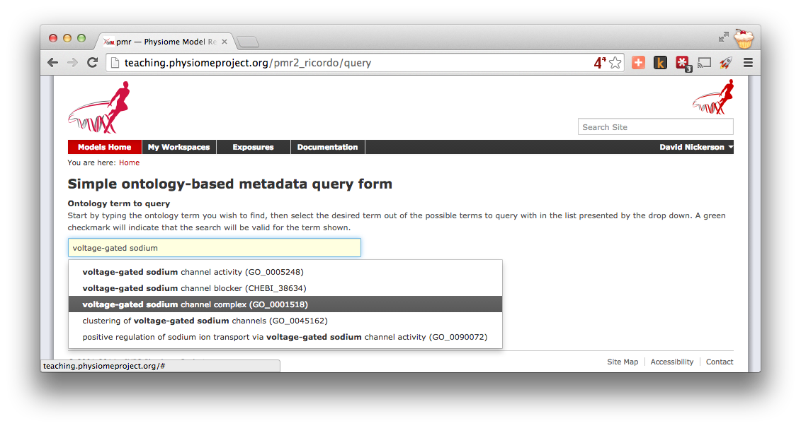
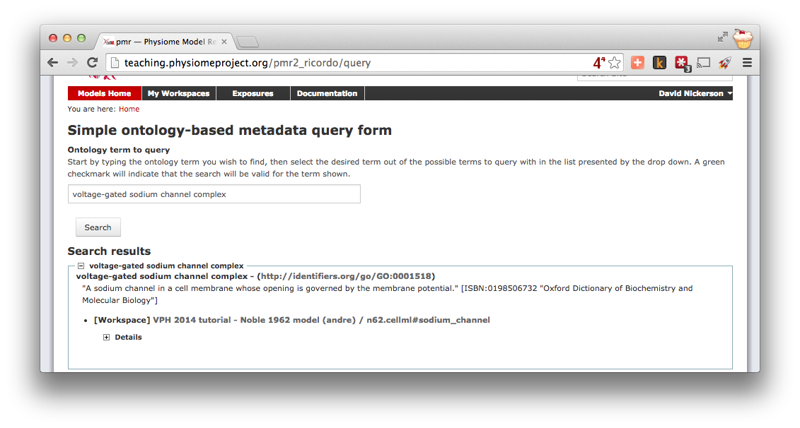

.. _tutorialOpenCOR-annotation:

Making use of annotations
=========================

Recent additions to :term:`PMR2` have focussed on :ref:`working with semantic metadata <semantic-metadata>`. In this part of the tutorial we will demonstrate how to take the annotated Noble (1962) model from the :ref:`previous tutorial <tutorialOpenCOR-newWork>` and index it in the repository's semantic knowledgebase for later retrival.

.. _teaching instance: http://teaching.physiomeproject.org

In the previous tutorial, you :ref:`annotated <tutorialOpenCOR-newWork-annotation>` your copy of the Noble (1962) model and :ref:`pushed <embc13-scenario1-opencor-push>` it up to the `teaching instance`_ repository. If you now visit your :term:`workspace` URL and navigate to the :guilabel:`RDF Indexing` tab (1), you will see that the ``n62.cellml`` is the only resource avaiable to be indexed (2).

Moving the ``n62.cellml`` file over to the box on the right indicates that it should be indexed (3) and selecting the :guilabel:`Apply Changes and Export to RDF Store` button (4) will apply the change and index the RDF obtained from the CellML document.

As long as everything is successful, you'll end up with a page similar to that shown below, and future revisions of the ``n62.cellml`` file will automatically be indexed in the RDF store.

Now that your model is indexed, lets try to find it. You can navigate to the :guilabel:`Ontology based search engine` from the front page of the `teaching instance`_.

In the search text field, you can begin typing the label of one of the terms you added to your copy of the Noble (1962) model. In this :ref:`example <tutorialOpenCOR-newWork-annotation>`, we used the term ``voltage-gated sodium channel complex``. As you type the auto-complete will kick in and you'll start to see suggested terms. As you refine your query the list will decrease and you will hopefully see one you remember entering.

Once you choose the desired term, you can click the :guilabel:`Search` button to exectute the search. Assuming you selected an ontology term that you used (or which someone else has used in another workspace) you should see your copy of the Noble (1962) model in the search results.

.. note::

   Because your workspace is still private, only you will see it in the search results even if you use the same annotation terms as others. Once a workspace is published, the associated annotations will become visible and searchable by all. Similarly, if you :ref:`share <sharingWorkspaces>` your workspace with another user they will then see your model show up in their search results for the appropriate ontology terms.
   
In future, OpenCOR will make use of PMR2 webservices to provide a similar interface as the repository web interface directly in the application. This will allow users to find and reuse existing models all in one place.
