.. _tutorialOpenCOR-newWork:

In the :ref:`Auckland Physiome Repository <abi-pmr2-index>`, a complete piece of work is stored in a :term:`workspace`. Each workspace is a :term:`Mercurial` repository, which allows the repository to maintain a complete history of all changes made to every file it contains. In this part of the tutorial, we take you through the creation of a new piece of work, which will be stored in a :term:`workspace`. Useful information on working with the repository using Mercurial is available in the :ref:`repository documentation <cellmlrepositorytutorial-hg>`.

A new CellML-based piece of work
================================

.. _teaching instance: http://teaching.physiomeproject.org

In this section we are going to create a new :term:`workspace` into which we will add a CellML model, annotate the model using :ref:`OpenCOR <OpenCOR-index>`, and simulate the model to check that it produces the expected results. We will be using the seminal `Noble (1962) <http://www.ncbi.nlm.nih.gov/pmc/articles/PMC1359535/>`_ cardiac cellular electrophysiology model as the demonstration model for this part of the tutorial.

.. _embc13-scenario1-opencor-newWorkspace:

Create a new workspace
----------------------

You can find instructions for creating a new workspace on the `teaching instance`_ repository in the :ref:`repository workspaces <creatingNewWorkspace>` documentation. Following those instructions, create a workspace similar to that shown below:

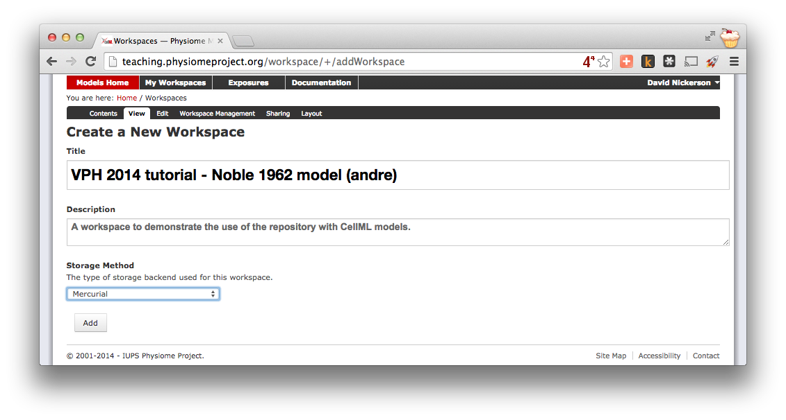

   Creating a new workspace to begin a scientific study based on the Noble 1962 cardiac cellular electrophysiology model.

Once you have created the workspace, you will be taken to the workspace listing page. Take particular note of the :guilabel:`URI for mercurial clone/pull/push`, also the same as the current page URL.

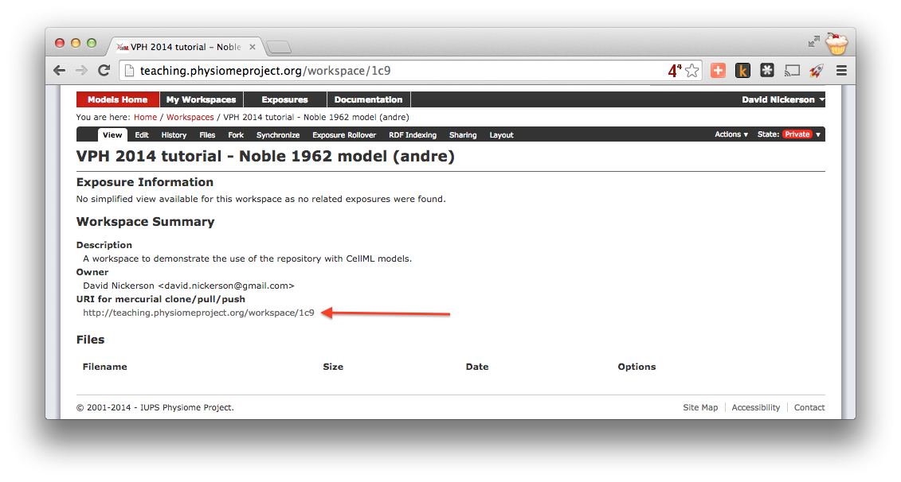

   A view of the newly created and empty workspace. Note: the workspace URI is unique to every workspace, so yours will be different to the one shown above.

In order to make changes to your workspace, you have to :term:`clone` it to your own computer. In order to do this, copy the URI for mercurial clone/pull/push as shown above. In Windows explorer, find the folder where you want to create the clone of the workspace. Then, right click to bring up the context menu, and select :menuselection:`TortoiseHG --> Clone` as shown below:

.. figure:: images/PMR-tut1-tortoisehgclone.png
   :align: center

Paste the copied URL into the :guilabel:`Source:` area and then click the :guilabel:`Clone` button. This will create a folder named after the workspace identifier (a hexadecimal number) that will be empty. The folder will be created inside the folder in which you instigated the clone command.

**Command line equivalent** ::

   hg clone [URI]

The repository will be cloned within the current directory of your command line window.

You will need to enter your username and password to clone the workspace, as the workspace will be set to *private* when it is created.

.. _EMBC13-OpenCOR-addingContent:

Populate with content
---------------------

We have prepared a copy of the `Noble (1962) <http://www.ncbi.nlm.nih.gov/pmc/articles/PMC1359535/>`_ model encoded in CellML ready for your use. You can download the model :download:`n62.cellml <models/n62.cellml>` and save it into your cloned workspace folder created above. To verify that the model works, you can load it into the :ref:`OpenCOR Single Cell view <OpenCOR-plugin-singlecellview>` and simulate the model for *5000 ms*. You can plot the variable *V* in the *membrane* component and you should see results as shown below:

.. |media-playback-start|
    image:: ../OpenCOR/resources/images/oxygen/actions/media-playback-start.png
        :width: 1.1em
        :height: 1.1em

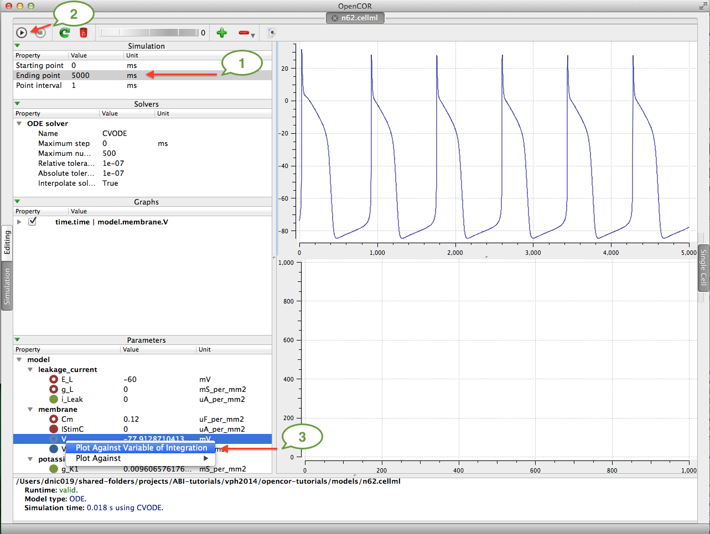

   The arrows highlight the :guilabel:`Ending point` which should be set to *5000 ms*, the |media-playback-start| button to run the simulation, and the variable ``V`` to be plotted.

.. todo::
   These images need to be updated if there is time.

As long as your results look similar to the above, everything is working as expected. Now is a good time to add the CellML model to the workspace record. The first step is to choose the :menuselection:`TortoiseHG --> Add Files...` option from the context menu for your workspace folder (1).

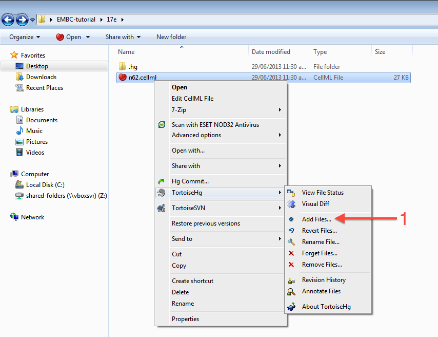

This will bring up the :guilabel:`hg add` dialog box, showing the files which can be added (in this case, only the ``n62.cellml`` file is available and it is selected by default). Clicking the :guilabel:`Add` button (2) will inform Mercurial that you want to add the selected file to the workspace.

.. figure:: images/addModel-2.png
   :align: center
   :width: 80%

In Windows Explorer, you will see the file icon for the ``n62.cellml`` model now overlaid with the Mercurial **+** icon (3) to indicate that you have added the file, but not yet committed it to the workspace.

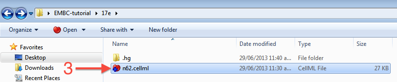

You can now commit the added file to the workspace by choosing :menuselection:`Hg Commit...` from the context menu in your workspace folder (4).

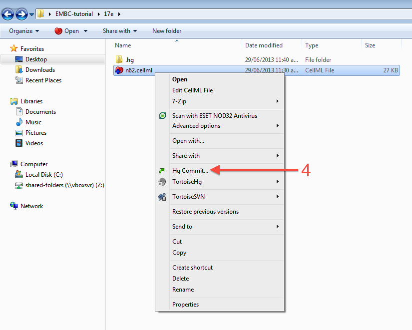

This will bring up the :guilabel:`commit` dialog, which lets you explore and select all the possible changes in this workspace that you can commit. In this case, there is just the addition of the ``n62.cellml`` file to be committed. Before committing, a useful log message should be entered - this will help you keep track of the changes you make to the workspace and possibly the reasons for why a given set of changes were made (for example, due to feedback from reviewers). After entering the log message, click the :guilabel:`Commit` button to commit the changes (5). The dialog will stay visible in case you have further changes to commit, but in this case you can just close the dialog.

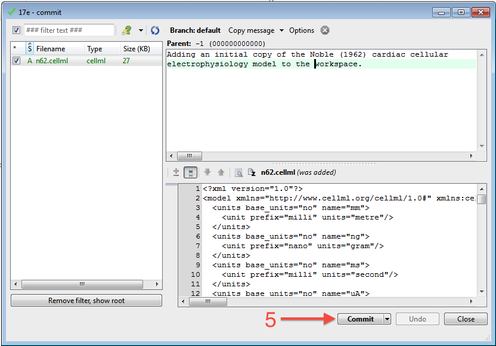

Once you have successfully committed the change, you will see that the icon for the ``n62.cellml`` file has now changed to a green tick (6) to indicate that the file is up-to-date with no modifications.

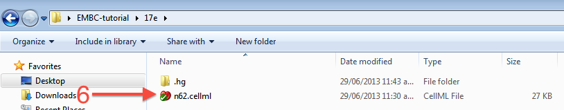

**Command line equivalent** ::

   hg add n62.cellml
   hg commit -m "Adding an initial copy of the Noble (1962) cardiac cellular electrophysiology model to the workspace."

.. _tutorialOpenCOR-newWork-annotation:

Annotating the model
--------------------

While we have the model open in OpenCOR, we should have a go at annotating some of the objects in the model. Full instructions for this can be found in the :ref:`OpenCOR CellML Annotation view <OpenCOR-plugin-cellmlannotationview>`. First, we will follow the :ref:`example given in those instructions <OpenCOR-annotateACellmlElement>` for annotating the ``sodium_channel`` component.

The first step is to switch to the :guilabel:`Editing` mode (1) (make sure that the :guilabel:`CellML Annotation` view is selected) and select the ``sodium_channel`` component for annotation (2). We will be using the ``bio:isVersionOf`` as the qualifier for this annotation (3) and searching for terms related to ``sodium channel`` (4).

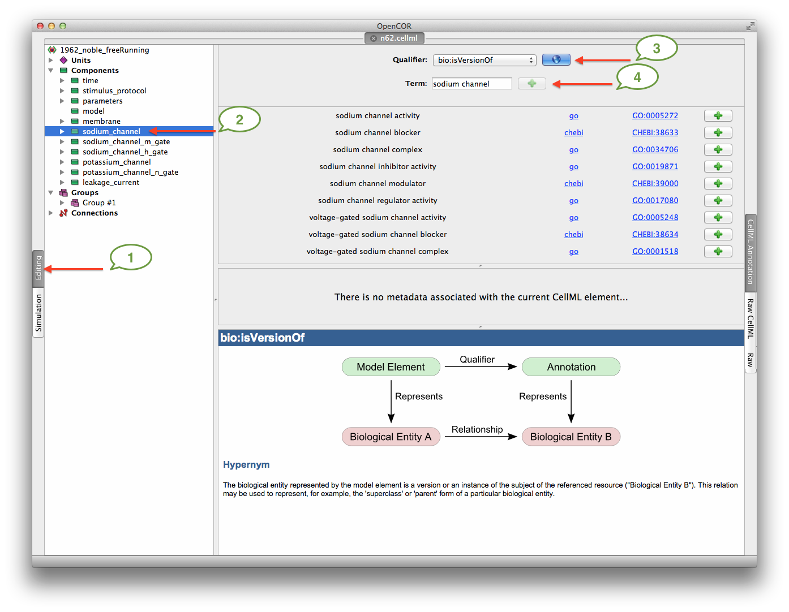

.. |list-add|
    image:: ../OpenCOR/resources/images/oxygen/actions/list-add.png
        :width: 1.1em
        :height: 1.1em

We can then add desireable terms from the search results by choosing the |list-add| button beside the term to add to the annotations for the ``sodium_channel`` component (5).

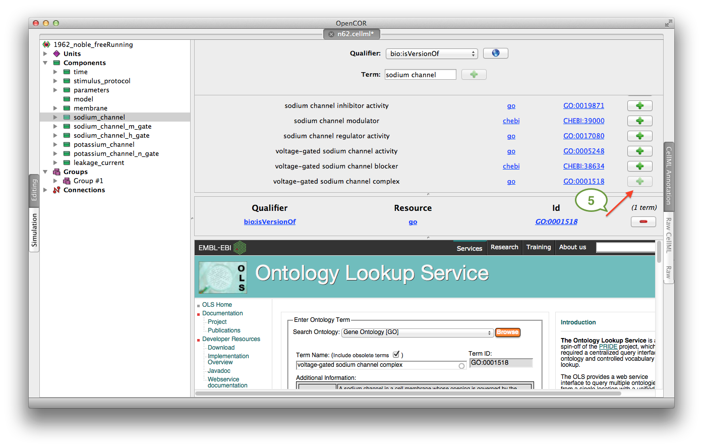

Have a play annotating other variables and components in the model. When done annotating, make sure to save the model (:menuselection:`File --> Save`). With the CellML model updated, now is a good time to commit the changes to the workspace.

Commit changes
--------------

As above, choose :menuselection:`Hg Commit...` from the context menu in your workspace folder to bring up the Mercurial :guilabel:`commit` dialog. This time, you will see that there is one file modified that can be committed, ``n62.cellml`` (1). As we mentioned previously, it is important to enter a good log message to keep a record of the changes you make (2), and the changes made to the currently selected file are shown to help remind you as to your changes (3). In this case, OpenCOR has made many changes to the whitespace in the file, as well as adding the RDF annotations at the bottom of the file.

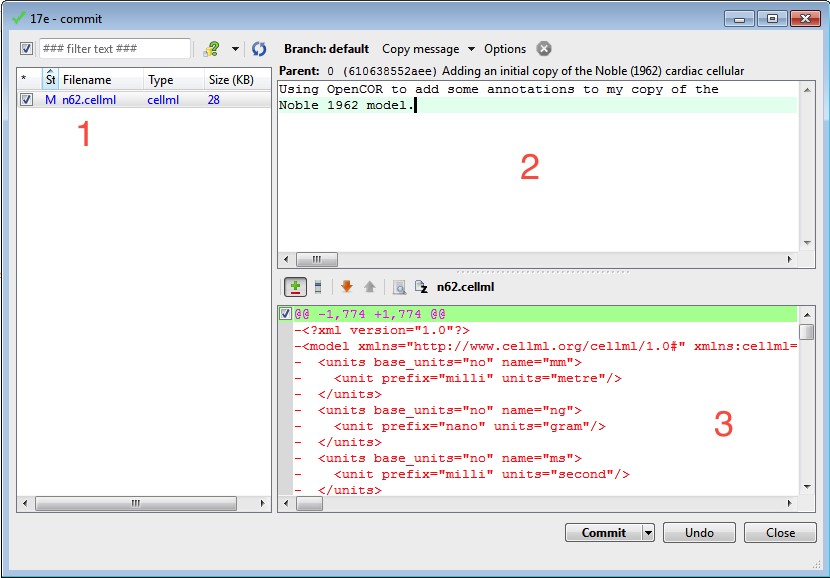

**Command line equivalent** ::

   hg diff
   hg commit -m "Using OpenCOR to add some annotations to my copy of the Noble 1962 model."

.. _embc13-scenario1-opencor-push:

Push back to the repository
---------------------------

Having added content and performed some modifications, it is time to :term:`push` the changes back to the model repository, achieved in TortoiseHG with the synchronization action. First, select :menuselection:`TortoiseHG --> Synchronize` from the context menu for your workspace folder.

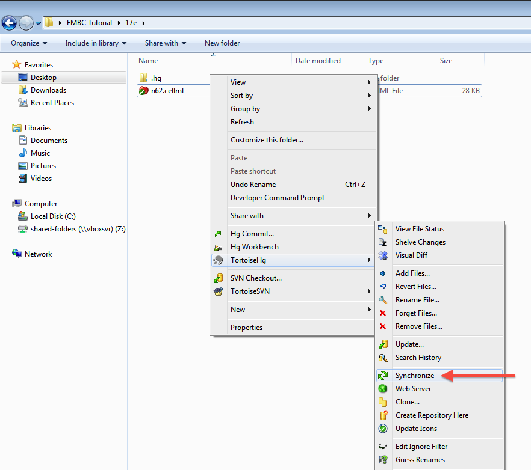

This will bring up the :guilabel:`TortoiseHG Sync` dialog. In this dialog, you will see that by default you will be synchronizing with the workspace on the teaching repository from which you originally created this clone. This is usually what you want to do, but it is possible to synchronize with other Mercurial repositories. In this case, we want to :term:`push` the changes we have made to the model repository, so choose the corresponding action from the toolbar (highlighted below).

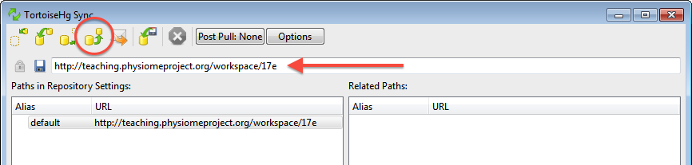

Once you choose the *push* action, you will be asked to confirm that you want to push to your remote repository and then asked for your username and password (these are the credentials you created when registering for an account in the model repository). You will then see a listing of the transaction as your changes are pushed to the repository and a message stating the push has completed.

**Command line equivalent** ::

   hg push

If you now return to browsing your workspace in your web browser, and refresh the page, you will see that your workspace now has some content - ``n62.cellml`` - and if you view the workspace history, you will see the log messages that you entered when committing your changes above.

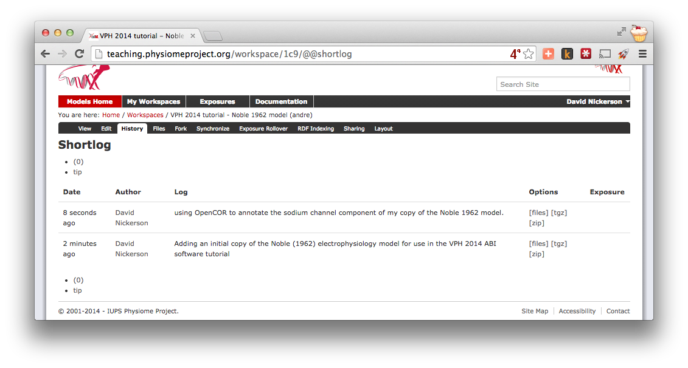

Now might be a good time to think about :ref:`sharing your workspace <sharingWorkspaces>` with your neighbours. You might also want to have a look at creating an :term:`exposure` for your workspace. To learn how to create exposures, please refer to :ref:`exposing-cellml`.
