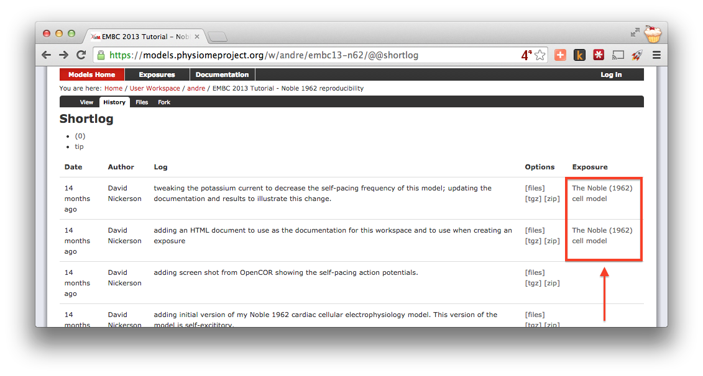
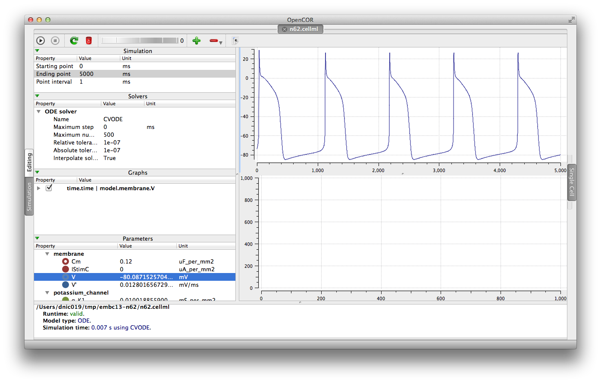
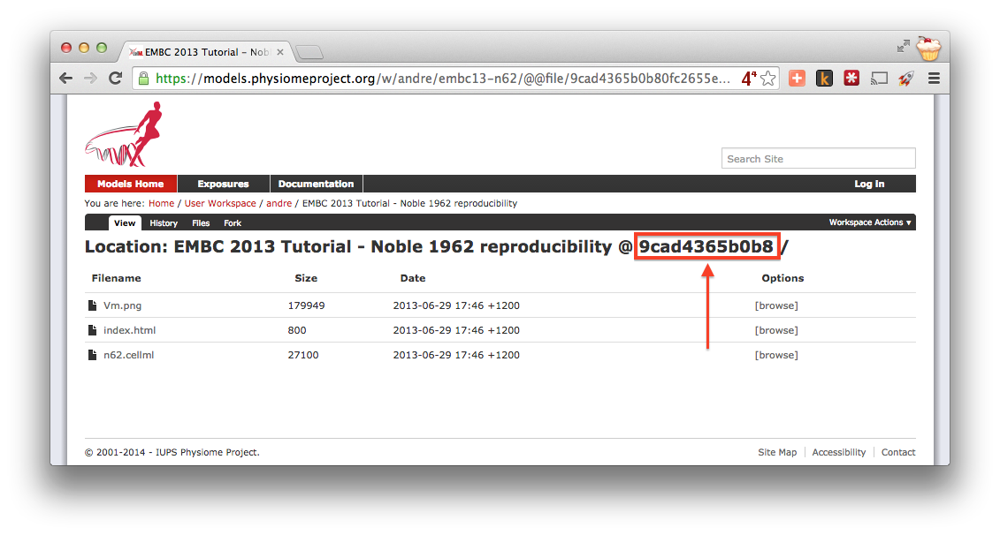
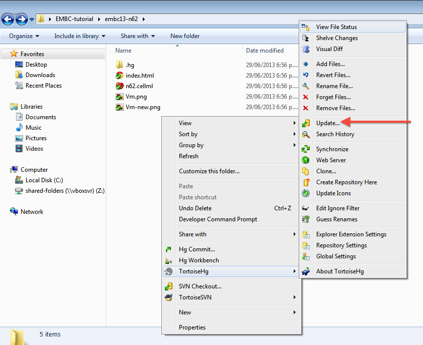
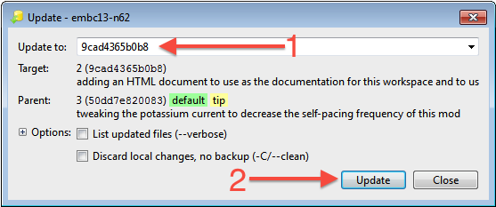
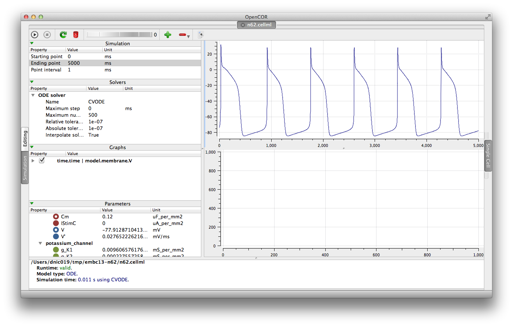

.. _tutorialOpenCOR-reproduce:

Reproducing model behaviour in OpenCOR
======================================

In this tutorial, we will be demonstrating how to reproduce the results from a CellML model as they were originally published. Because the repository makes use of :term:`Mercurial`, even if a :term:`workspace` has continued being developed after a particular revision is published, we are able to step back through the workspace history to reproduce those original published results.

Following on from the :ref:`previous tutorial <tutorialOpenCOR-newWork>`, we make use of the `Noble (1962) <http://www.ncbi.nlm.nih.gov/pmc/articles/PMC1359535/>`_ cardiac cellular electrophysiology model. In this tutorial, we will use the version of this model published in the repository and available here: `<https://models.physiomeproject.org/e/174>`_. If you navigate from that :term:`exposure` to the :term:`workspace` you can check the history as `shown below <https://models.physiomeproject.org/w/andre/embc13-n62/@@shortlog>`_.

As you can see highlighted in the :guilabel:`Exposure` column of the history above, there are two exposures for this workspace. For the purposes of this tutorial, we will assume that the `earlier exposure <https://models.physiomeproject.org/e/173>`_ corresponds to a study that has been published in a scientific journal. The `later exposure <https://models.physiomeproject.org/e/174>`_ is the result of further work on this model following the publication of the journal article. The later exposure illustrates the difference between these two versions of the model. In this tutorial, we aim to reproduce the results as shown in the published journal article - corresponding to the earlier exposure.

.. important::
   It is essential to use a Mercurial client to obtain models from the repository for editing. The Mercurial client is not only able to keep track of all the changes you make (allowing you to back-track if you make any errors), but using a Mercurial client is the only way to add any changes you have made back into the repository.

Cloning an existing workspace
-----------------------------

The first step is to :term:`clone` the workspace containing the model we want to work with. The steps to clone a workspace were demonstrated in the :ref:`previous tutorial <tutorialOpenCOR-newWork>`. In summary:

#. Copy the source URI for Mercurial clone/push/pull (*i.e.,* ``https://models.physiomeproject.org/w/andre/embc13-n62``);
#. :term:`Clone` the repository (:menuselection:`TortoiseHG --> Clone` or ``hg clone [uri]``) to a folder on your machine.

Check the model
---------------

Now that we have the model, we want to ensure that we are able to produce the current results that it should produce. Load the ``n62.cellml`` file in the newly cloned folder into OpenCOR and run a simulation for *5000 ms* and plot the membrane potential, ``V``. This should result in a similar graph to that shown in the upper figure of the exposure page, reproduced here for convenience.

Notice that in the *5000 ms* simulation there are **five** action potentials.

Revert to an earlier version of the model
-----------------------------------------

Now that we are happy the current version of the model reproduces the results that it should, we want to go back to the version of the model that was published in a journal article. This is commonly required because the new work you might want to do with the model will be based on the published model, not its latest version which may have deviated from the validated model which was published.

Using :term:`Mercurial`, there are several methods by which you can jump around the history of a :term:`workspace`. The particular method that works best depends a lot on what you want to do with the workspace once you change back to a revision that is not the most recent. Searching the internet for information on the Mercurial (hg) commands: ``revert``, ``update``, and ``branch``; is probably a good place to start working out which is best for your situation. In this case, we have a fairly simple requirement to go back to the revision prior to the current one so that we can reproduce some simulation results. If we were actually going to do further development in this workspace, we would need a more elaborate solution than that described below.

Here, we need to update our local clone of the workspace to a state matching the published journal article. In order to do this, we need to find the appropriate revision identifier to use with our Mercurial client. We can find the revision identifier by navigating to the workspace history tab in the model and choosing the :guilabel:`[files]` link for the revision corresponding to the earlier exposure, shown below.

.. figure:: images/reproduce03.png
   :align: center
   :width: 80%

From the files page, you will see the required revision identifier as highlighted in the image below.

You should copy this identifier to the clipboard ready for use in the next step. In your local clone of the workspace, select :menuselection:`TortoiseHG --> Update...` from the context menu. This will bring up the :guilabel:`Update` dialog.

In this dialog, you should paste the revision identifier copied above into the :guilabel:`Update to:` field (1) and then click the :guilabel:`Update` button (2).

**Command line equivalent** ::

   hg update -r 9cad4365b0b8

You will now see in your local clone that the files have reverted back to that previous version. Loading this version of ``n62.cellml`` into OpenCOR and simulating for *5000 ms* should result in the figure matching that presented in the earlier exposure page and reproduced here for convenience.

Note in particular that there should now be the same **six** action potentials that were present in the published version of the model.
